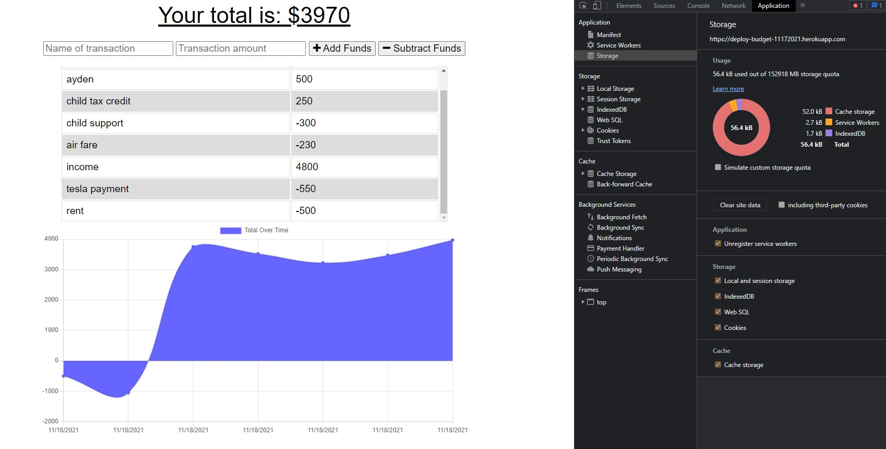

# Progressive Web Application - Progressive Budget

## Description
```
This is a Progressive Web Budget application that allows a user to add a transaction, 
and save to the database. If your internet goes down the Progressive Web Application 
function will automatically allow a user to still use the app and add a transaction. 
When the internet restores the data you entered in will automatically be saved.
```



---

## Function

This application functions using a PWA or progressive web application using a web manifest, service worker and cache function which allows a user to use an app when the internet goes down.

---

## Table of Contents

[Description](#description)

[Study-Material](#Study-Material)

[Features](#features)

[Links](#links)

[Author](#author)

---
## Study-Material

[Mongodb](https://www.mongodb.com/)

[Mongodb Methods](https://docs.mongodb.com/mongodb-shell/reference/methods/)

[Mongoose](https://mongoosejs.com/docs/5.x/docs/models.html)

[Express](https://expressjs.com/en/starter/hello-world.html)

[Cache](https://web.dev/offline-cookbook/#cache-falling-back-to-network)

[Mozilla Web Manifest](https://developer.mozilla.org/en-US/docs/Web/Manifest)

[Mozilla Service Worker](https://developer.mozilla.org/en-US/docs/Web/API/ServiceWorker)

---

## Features

This app was built using HTML 3, CSS 6, Javascript, Express, Mongoose, Web Manifest, Service Worker, Cache and Progressive Web Application

---

## Links

[GitHub Repository](https://github.com/jmoniz155/progressive-budget)

[Heroku Deployed App](https://deploy-budget-11172021.herokuapp.com/)

---
---

## Author


`Jesse Moniz: UCSD coding student in San Diego, CA`


| Name          | Email                 | Github                        | Linkedin                                              |
| ------------- | --------------------- | ----------------------------- | ----------------------------------------------------- |
| Jesse Moniz   | Jmoniz155@gmail.com   | https://github.com/jmoniz155  | https://www.linkedin.com/in/jesse-moniz-98693621a/    |